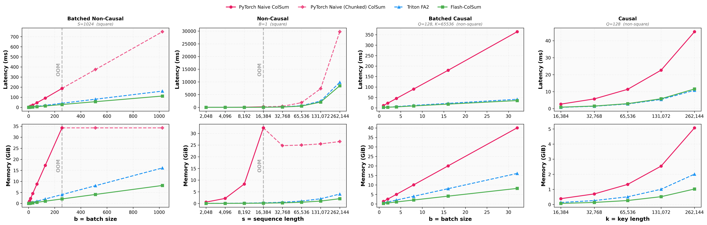
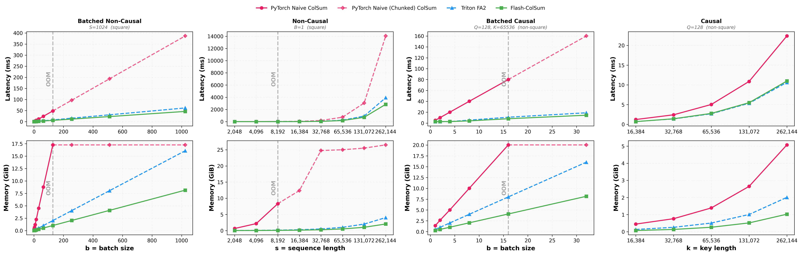

# Flash-ColSum

[](https://pypi.org/project/flash-colsum/)
[](LICENSE)
[](https://www.python.org/downloads/)

**Flash-ColSum** provides highly optimized Triton kernels for computing the column sums (or means) of the attention matrix **without materializing the full $O(N^2)$ attention weights**.

This primitive is essential for **KV-cache pruning** and **attention analysis** in Large Language Models (LLMs) and Vision-Language Models (VLMs). It powers the visual token pruning in [SparseVILA](https://arxiv.org/abs/2510.17777).

## Highlights

- **🚀 Efficient**: Fused kernels compute column statistics in **$O(N)$ memory**, enabling 128k+ context lengths.
- **🧩 Flexible**: Supports **causal** and **non-causal** attention with irregular shapes ($M \neq N$).
- **✅ Exact**: Uses online softmax for numerical precision and correct causal masking.

## Prerequisites

- **Python**: 3.10+
- **PyTorch**: 2.1+ (with CUDA support)
- **Triton**: 3.0.0+
- **GPU**: NVIDIA GPU with Compute Capability 8.0+ (Ampere or newer recommended)

## Installation

Install from PyPI:
```bash
pip install flash-colsum
```

Or build from source:
```bash
git clone https://github.com/z-lab/flash-colsum.git
cd flash-colsum
pip install -e .
```

## Usage

### 1. Non-Causal Attention

Compute the column sum of the attention matrix $\text{Softmax}(QK^T)$.

```python
import torch
from flash_colsum import flash_colsum

q = torch.randn(8, 16, 512, 64, device="cuda", dtype=torch.float16)
k = torch.randn(8, 16, 512, 64, device="cuda", dtype=torch.float16)

flash_colsum(q, k)  # Shape: (8, 512)
```

### 2. Causal Attention

Handle autoregressive attention where $M \neq N$. The kernel applies a **right-aligned causal mask**.

```python
import torch
from flash_colsum import flash_colsum, flash_colmean

q = torch.randn(1, 32, 128, 128, device="cuda", dtype=torch.float16)
k = torch.randn(1, 32, 4096, 128, device="cuda", dtype=torch.float16)

# Column sums with causal masking
flash_colsum(q, k, is_causal=True)  # Shape: (1, 4096)

# Column means (normalized by the number of valid queries per key)
flash_colmean(q, k, is_causal=True)  # Shape: (1, 4096)
```

## Performance

Flash-ColSum achieves significant speedups and memory savings over naïve implementations. By fusing the softmax and reduction steps, it avoids writing the huge $B \times H \times M \times N$ matrix to GPU memory.


*Benchmarked on NVIDIA RTX A6000 with FP16 precision*


*Benchmarked on NVIDIA GeForce RTX 5090 with FP16 precision*

## Development

### Project Structure
```
flash-colsum/
├── flash_colsum/          # Source code
│   ├── flash.py           # Triton kernels & API
│   └── naive.py           # Reference PyTorch implementations
├── benchmarks/            # Performance scripts
└── tests/                 # Correctness tests
```

### Running Tests
```bash
# Install test dependencies
pip install -e ".[test]"

# Run correctness tests
pytest -v
```

### Running Benchmarks
```bash
# Run benchmark sweeps
FLASH_COLSUM_RUN_BENCH=1 pytest tests/test_benchmarks.py -v -s
```

## Citation

If you use Flash-ColSum in your research, please cite the SparseVILA paper:

```bibtex
@inproceedings{khaki2025sparsevila,
  title = {{SparseVILA: Decoupling Visual Sparsity for Efficient VLM Inference}},
  author = {Khaki, Samir and Guo, Junxian and Tang, Jiaming and Yang, Shang and Chen, Yukang and Plataniotis, Konstantinos N and Lu, Yao and Han, Song and Liu, Zhijian},
  booktitle = {Proceedings of the IEEE/CVF International Conference on Computer Vision (ICCV)},
  year = {2025}
}
```

## License

[MIT License](LICENSE)

## Acknowledgments

- **[FlashAttention](https://github.com/Dao-AILab/flash-attention)**: The tiling and online softmax approach is heavily inspired by FlashAttention.
- **[SparseVILA](https://arxiv.org/abs/2510.17777)**: The original project that necessitated this primitive.
